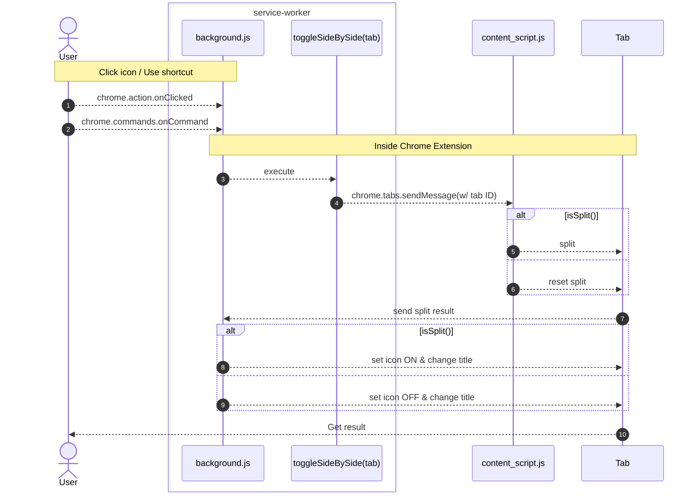
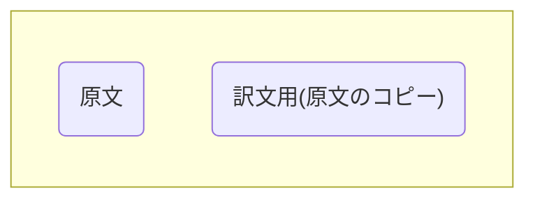

## TL;DR

自分用に作った Chrome 拡張機能を紹介です｡
Chrome 拡張機能のインストールは[こちら](https://chrome.google.com/webstore/detail/ljemoeeinmimkamnneillooodljolhfd)から

↓ デモ動画
https://www.youtube.com/watch?v=_C9fitoRKk8
簡単にタブ内で左に原文､右に訳文を表示して､スクロールという形を実現できます｡

## きっかけ

最近､仕事上や趣味の個人開発でも英語のドキュメントに当たることが多くなってきました｡

その際の課題として､英語のままだと資料を読むスピードが上がらないという課題がありました｡

そこで､ページを全体を Google 翻訳して日本語で確認したりしていたのですが､
どうしても訳文が微妙に間違っていたり､最後には原文をチェックしておきたくなることも多く
訳文と原文を何度も行き来する必要があり煩わしく感じていました｡

そこで､自分で Chrome 拡張を作成することにしました｡

:::message
一時は､左右に複製したタブを開き､片方のタブを翻訳していましたが
操作が多く面倒で､この方法は定着しませんでした｡
:::

## 設計

### 動作のデザイン

大まかに一連の流れを整理すると
`何かしらの動作 -> タブ内で2画面表示 -> 翻訳`
このようになります｡

### 使用技術

この流れを Chrome 拡張機能を用いて実現していきます｡
Chrome 拡張機能は､[この資料](https://zenn.dev/alvinvin/books/chrome_extension)が非常にまとまっていて､とても助かりました｡

Chrome 拡張は､意外と JS そのものを使用してスタートすることができるので
あまりフレームワークに慣れていない､初学者の方にもおすすめです｡

### 処理の流れ

手間なのですが､実装を始める前に簡単に処理の流れを書いておくことをおすすめします｡

私は､よく[mermaid.js](https://mermaid.js.org/)を使用します｡

@[card](https://mermaid.js.org/)

先に､こういったものを書いておくと､

- 実装中の手戻りが少なくなる
- 実装しながらちょくちょく確認できたり
- あとで見返すときにすぐ記憶が戻ってくる

などの嬉しさがあります｡

ある程度の規模以上の場合は,なるべく作るようにしています｡

:::message
下記のように､なんちゃってシーケンス図を書いておきます｡
矢印の種類等は間違っているかもです､､､
:::



<!-- いざ､作ると思うのですが､やはり便利です｡ -->

## 実装

Chrome 拡張の[公式ドキュメント](https://developer.chrome.com/docs/extensions/mv3/)を見ながら実装を進めていきます｡

@[card](https://developer.chrome.com/docs/extensions/mv3/)

### 実際のコード

#### Chrome 拡張機能テンプレート

@[card](https://github.com/mubaidr/vite-vue3-chrome-extension-v3)
[こちら](https://github.com/mubaidr/vite-vue3-chrome-extension-v3)のレポジトリをテンプレートに環境を構築しました｡

Vue ベースなのは慣れで選びました｡
ホットリロード(=拡張機能の更新時に､ソース更新をしなくてよい)が
便利過ぎて手放せないです｡

#### 分割の方法について

タブ内での分割は､なかなか良い方法･ライブラリを見つけることができませんでした｡
最終的には､画面内の要素をまるっとコピーして左にオリジナル､右に翻訳用という形で
[CSS Grid](https://developer.mozilla.org/ja/docs/Web/CSS/CSS_grid_layout/Basic_concepts_of_grid_layout) を用いて 2 ペイン表示を実施しています｡



> `side_by_side_container` の `div` 要素配下に､原文とそのコピーを`div` 要素で囲ったものを用意

```css:コンテナに適用するCSS
#side_by_side_container {
  display: grid;
  grid-auto-columns: 49.5%;
  grid-auto-flow: column;
  column-gap: 1%;
}
```

そして､このコンテナに上記の CSS をあてることで 1:1 の分割を実現してくれます｡

:::message
これは､かなり強引な方法だなと思っており別の良い方法があれば教えていただきたいです｡

上手く動かなければ､拡張機能を OFF にして読めば良いかと割り切っています｡
:::

最終的には､下記のような形でこれらを実現しています｡

```js:content-script.js
function split() {
  // wrap src document
  $("body")
    .children()
    .wrapAll("<div id='side_by_side_src' class='pane' translate='no'></div>");
  $("body").append(
    "<div id='side_by_side_dst'  class='pane' translate='yes'></div>"
  );

  $("#side_by_side_src").children().clone().appendTo("#side_by_side_dst");
  $("body").children().wrapAll("<div id='side_by_side_container'></div>");
}
```

拡張機能を ON にした場合は､この関数でページを加工し､
拡張機能を OFF にする場合は､`split()`でしていることの逆を行います｡

:::details jQuery
JS の学習は 1 年半ほどなのですが jQuery という素晴らしいライブラリを見つけた!!と思っていたところ
はるか昔の技術らしいと知って､驚きました｡
:::

#### Google 日本語翻訳との連携について

タブ内に 2 ペイン作成することができたので､次は翻訳するステップになります｡

こちらは､ [translate](https://developer.mozilla.org/en-US/docs/Web/HTML/Global_attributes/translate)属性というものを用いました｡

@[card](https://developer.mozilla.org/en-US/docs/Web/HTML/Global_attributes/translate)

正直に言うと､この属性の存在を知ったのが､この拡張機能を作ろうと思ったきっかけでした｡

```js
<div translate='no'></div> // 原文用
<div translate='yes'></div>// 訳文用
```

この属性を用いることで､ページ全体を翻訳した際に原文が翻訳されず､
訳文用の要素のみが翻訳されることになります｡

### 詰まったところ

#### 状態管理ミス

はじめは､拡張機能の ON/OFF 状態をタブごとに管理しようと考えてました｡
進めていくうちにタブの更新や遷移時の挙動が無茶苦茶になってしまったので､一度作り直しました｡

`KISS` = `Keep It Simple, Stupid.`の法則を実感しました｡

`isSplit()` でタブが分割されているかどうかを取得することで
タブごとの状態の管理をやめ､実装もシンプルでわかりやすいものになりました｡

#### i18n 対応

今回､世界中の方に使っていただきたいので､多言語対応(i18n)を行いました｡
実装の詳細については､[公式](https://developer.chrome.com/docs/extensions/reference/i18n/)が非常によくまとまっています｡ [^2]
@[card](https://developer.chrome.com/docs/extensions/reference/i18n/)

:::message alert
使用した[テンプレート](https://github.com/mubaidr/vite-vue3-chrome-extension-v3)特有の問題だと思いますが､

`_locales`フォルダの位置には注意が必要です｡[^1]
`src` フォルダ配下に配置するのではなく､root 階層(=`src` フォルダと同階層)に配置する必要があります｡

:::

### 割り切ったこと

技術的には

- サイトによっては､表示が崩れる
  ON/OFF の切り替えも高速なので､その場合は OFF にして再読み込みしてください!
- Chrome の全文翻訳機能を JS からコントロール(したかったけど､どうもできないみたい)
- 原文と訳文の縦位置がズレてしまう
  - 長めのサイトだと顕著です
  - 特に日本語は長くなりがちです

思想的な部分では

- 分割後の画面遷移はどうするのか[^3]

があります｡

### リリース

ここは､時間をかけていないですが
拡張機能の ON/OFF がパッと見でわかるようにアイコンを作成しました｡

- 拡張機能アイコン作成
- ストア登録
  - Google の開発者登録が必要です
- ストア用スクリーンショット && デモ動画作成
  - 初めてデモ動画をつけてみました｡やはりパッと見で動きがわかるので､良いですね

## さいごに

### ソースコード全文

文字多め､ソースコード少なめでした｡
下記 URL にソース全文を置いておきます｡
https://github.com/ut0s/side-by-side-translation

コメント､改善方法等大歓迎です!!
よろしくお願いします

[^1]: https://github.com/crxjs/chrome-extension-tools/issues/599
[^2]: 正直､ドキュメント内での情報量の差がすごいです｡
[^3]:
    自分で使っていても､ページ遷移後も ON のままにして欲しい場合と
    遷移後は OFF にしたい場合が混在するので､一旦後回しにしました､､､
    また､戻る/進む動作についても簡略化のために見えないふりをしています
